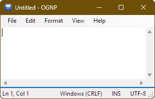

# ognp — OG Notepad

[](https://github.com/raystanza/ognp/actions/workflows/release-windows.yml)
[](https://github.com/raystanza/ognp/actions/workflows/codeql.yml)
[](LICENSE)
[](https://github.com/raystanza/ognp/releases)
[](https://github.com/raystanza/ognp/releases)

_A faithful, minimal re-creation of classic Windows Notepad, built for speed and simplicity._

> **Why?** Recent changes to Windows Notepad left some folks missing the old, ultra-simple experience. **ognp** aims to be that: fast, tiny, dependency-free, and familiar.

---

## Features

- **Classic UI & behavior**
  - File: New / Open / Save / Save As… / Page Setup / Print / Print Preview / Exit
  - Edit: Undo, Cut/Copy/Paste/Delete, **Find**, **Find Next (F3)**, **Replace**, **Go To (Ctrl+G)**, **Time/Date (F5)**, Select All
  - Format: **Word Wrap** (off by default), **Font…**
  - View: **Status Bar** (hidden when Word Wrap is on, like the original)
  - Help: About
- **Encodings**
  - Detects BOM for UTF-8/16/32; otherwise defaults to **ANSI** (system code page)
  - “Save As” lets you choose: ANSI, UTF-8, UTF-8 (BOM), UTF-16 LE/BE, UTF-32 LE/BE
- **Line endings**
  - Detects & preserves **CRLF / LF / CR** on save
  - Status bar shows current EOL and encoding
- **Quality-of-life**
  - Drag & drop files to open
  - Accurate cursor position and selection length in the status bar
- **No bloat**
  - No telemetry, no network calls, no AI, & **no external packages**
  - Single portable `.exe` (no installer required)

> **Non-goals:** This isn’t a code editor. No tabs, no plugins, no syntax highlighting—just a classic text editor.

---

## Screenshot



---

## Download

Head to the **[GitHub Releases](https://github.com/raystanza/ognp/releases)** page and grab the latest assets:

- `ognp.exe` — portable Windows executable
- `ognp.exe.sha256` — checksum file for verification

> **Supported OS:** Windows 10/11.
> The published build is self-contained. If you ever see a runtime prompt, it is for the **.NET Desktop Runtime 9.0**. If your system is up-to-date, with 'Windows Updates', you should _NOT_ see this message.  However, if you do, please install the **.NET Desktop Runtime 9.0**.

---

## Verify your download (recommended)

**Windows (PowerShell):**

```powershell
cd "folder\where\you\downloaded\files"
$expected = (Get-Content .\ognp.exe.sha256).Split(" ")[0]
$actual   = (Get-FileHash -Algorithm SHA256 .\ognp.exe).Hash.ToLower()
if ($actual -eq $expected) { "OK: SHA256 matches." } else { "MISMATCH!" }
```

---

## How to run

Double-click `ognp.exe` to launch, or open a file from the command line:

```powershell
ognp.exe "C:\path\to\file.txt"
```

You can also **drag & drop** a file onto the window to open it.

---

## Keyboard shortcuts

- **File:** `Ctrl+N` New · `Ctrl+O` Open · `Ctrl+S` Save · `F12` Save As
- **Edit:** `Ctrl+F` Find · `F3` Find Next · `Ctrl+H` Replace
  `Ctrl+G` Go To · `Ctrl+A` Select All · `F5` Time/Date
- **Format/View:** Word Wrap toggles Go To & Status Bar availability (classic behavior)

---

## Text encoding & line endings

- If a file has a **BOM**, ognp uses it.
- If not, ognp opens as **ANSI** (your system’s default code page).
- “Save As” lets you choose encodings explicitly.
- EOL style (**CRLF / LF / CR**) is detected on open and preserved on save.

---

## Printing

Use **File → Page Setup / Print** for classic printing behavior. Long lines wrap across pages; headers/footers are intentionally minimal (in keeping with Notepad’s feel).

---

## File associations (optional)

To make ognp your default editor for `.txt` files:

1. Right-click any `.txt` → **Open with** → **Choose another app**
2. **Browse** to `ognp.exe`, check **Always use this app**, and confirm.

---

## Privacy & security

- ognp has **no network features** and **no telemetry**.
- If you discover a security issue, please open a **private advisory** or email the maintainer (avoid public issues for security topics).

See [`SECURITY.md`](SECURITY.md) for details.

---

## Frequently asked

**Does it support tabs or syntax highlighting?**
No—by design. ognp focuses on the classic Notepad experience.

**Can I change the default encoding?**
Use **Save As** to choose a specific encoding for output. Files without a BOM open as ANSI.

**Why is the Status Bar hidden sometimes?**
When **Word Wrap** is on, the status bar hides—this matches the original Notepad behavior.

---

## Support & feedback

- **Bugs & requests:** open an **Issue** on GitHub (include Windows version and repro steps)
- **Discussions Q&A:** use **Discussions** if enabled on the repo

For development guidelines, see **[`CONTRIBUTING.md`](CONTRIBUTING.md)**.

---

## License

**GPL-3.0-or-later.** See [`LICENSE`](LICENSE) for details.

---

## Acknowledgements / Trademarks

- Inspired by **Microsoft® Windows® Notepad**.
- “Microsoft” and “Windows” are registered trademarks of Microsoft Corporation.
- This project is not affiliated with or endorsed by Microsoft and/or its related entities.
- This project does not solicit funds, donations, or monetary gain in any capacity.
