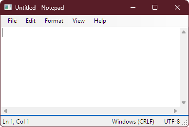

# ognp — OG Notepad

_A faithful, minimal re-creation of classic Windows Notepad, built with C#/.NET and WinForms._

> **Why?** Recent changes to Windows Notepad left some folks missing the old, ultra-simple experience. **ognp** aims to be that: fast, tiny, dependency-free, and familiar.

---

## Features

- **Classic UI & behavior**
  - File: New / Open / Save / Save As… / Exit
  - Edit: Undo, Cut/Copy/Paste/Delete, **Find**, **Find Next (F3)**, **Replace**, **Go To (Ctrl+G)**, **Time/Date (F5)**, Select All
  - Format: **Word Wrap** (off by default), **Font…**
  - View: **Status Bar** (hidden when Word Wrap is on, like the original)
  - Help: About
- **Encodings**
  - Detects BOM for UTF-8/16/32; otherwise defaults to **ANSI** (system code page)
  - “Save As” lets you choose: ANSI, UTF-8, UTF-8 (BOM), UTF-16 LE/BE, UTF-32 LE/BE
- **Line endings**
  - Detects & preserves **CRLF / LF / CR** on save
  - Status bar shows current EOL and encoding
- **No bloat**
  - No telemetry, no network calls, No Co-Pilot, **no external NuGet packages**
  - Pure WinForms, .NET 9 (Windows only)

> **Non-goals:** This isn’t a code editor. No tabs, no plugins, no syntax highlighting—just a classic text editor.

---

## Screenshot



---

## Getting Started

### Requirements

- Windows 10/11
- [.NET SDK 9.0](https://dotnet.microsoft.com/en-us/download)

### Build & Run (CLI)

```powershell
git clone https://github.com/raystanza/ognp.git
cd ognp
dotnet run --project ognp
```

### Pack a portable EXE (self-contained)

```powershell
dotnet publish ognp -c Release -r win-x64 `
  -p:PublishSingleFile=true `
  -p:IncludeNativeLibrariesForSelfExtract=true `
  --self-contained true
# Output in: .\ognp\bin\Release\net8.0-windows\win-x64\publish\ognp.exe
```

> For ARM64: use `-r win-arm64`.

---

## Usage

- Launch `ognp` normally, or open a file from the command line:

  ```powershell
  ognp.exe "C:\path\to\file.txt"
  ```

- **Shortcuts**

  - `Ctrl+N` New `Ctrl+O` Open `Ctrl+S` Save `F12` Save As
  - `Ctrl+F` Find `F3` Find Next `Ctrl+H` Replace
  - `Ctrl+G` Go To `Ctrl+A` Select All `F5` Time/Date
  - Word Wrap toggles Go To & Status Bar availability (classic behavior)

---

## Design Notes

- **ANSI-first mindset:** If no BOM is present, files open as ANSI (system default code page).
- **Preserve user intent:** EOL style is detected on open and preserved on save.
- **Tiny surface area:** Only standard WinForms controls; no designer file; UI built in code.

---

## Roadmap

- Printing (Page Setup / Print / Print Preview)
- MRU (“Recent Files”) menu
- Drag-and-drop to open
- Optional command-line `+<line>` support (jump to line on open)

> Have a small, classic-friendly idea? Open an issue to discuss before implementing.

---

## Contributing

Contributions are welcome!
Please keep changes **small, focused, and faithful** to classic Notepad.

1. Open an issue describing the problem/idea.
2. Fork → create a feature branch → commit with clear messages.
3. Ensure `dotnet build` and `dotnet test` (if present) pass.
4. Open a PR referencing the issue.

**Style & principles**:

- No external dependencies.
- Favor plain WinForms and standard library APIs.
- Keep UI simple and accessible; respect system themes and DPI.

> See [`CONTRIBUTING.md`](CONTRIBUTING.md) for full guidelines.

---

## Security

This is an offline text editor with no network features.
If you discover a security issue, please open a private advisory or email the maintainer.

---

## License

GPL-3.0-or-later.
See [`LICENSE`](LICENSE) for details.

---

## Acknowledgements / Trademarks

- Inspired by **Microsoft® Windows® Notepad**.
- “Microsoft” and “Windows” are registered trademarks of Microsoft Corporation.
- This project is not affiliated with or endorsed by Microsoft and/or its related entities.
- This project does not solicit funds, donations, or monetary gain in any capacity.
